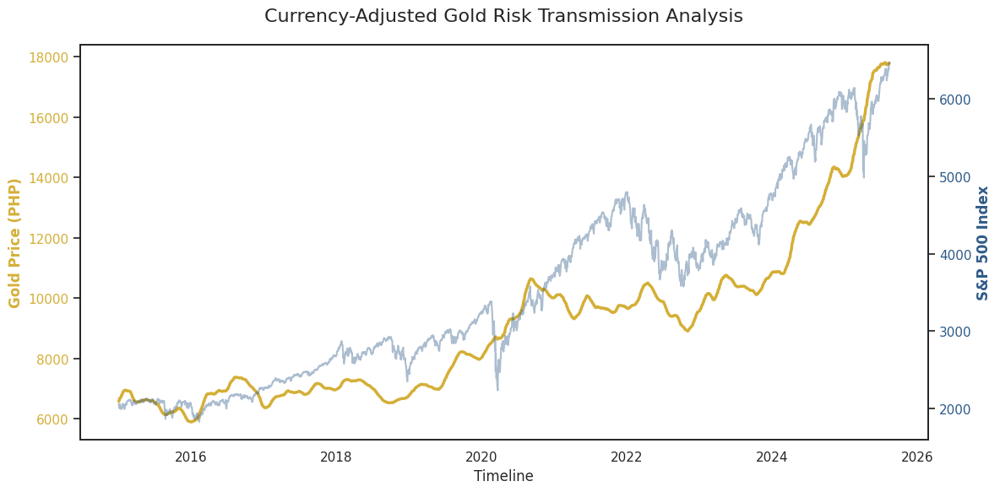

# Currency-Adjusted Asset Correlation: Gold as a Macro-Hedge in the Philippine Market

This project demonstrates an end-to-end data engineering and analytics pipeline designed to quantify the relationship between global equity markets (S&P 500) and localized commodity prices (Gold in PHP). The goal was to determine the 'Safe Haven' effectiveness of Gold for Philippine-based investors during periods of high US market volatility.

## **Technical Highlights**
* **Cloud Data Ingestion:** Automated retrieval of 10+ years of historical market data using the **Google BigQuery** Python client.
* **Localized Feature Engineering:** Developed a SQL-based currency conversion layer to transform USD-denominated Gold prices (GLD) into Philippine Pesos (PHP), providing a localized risk perspective.
* **Data Smoothing:** Implemented **SQL Window Functions** (`AVG() OVER`) to calculate a 30-day Moving Average, filtering out short-term market volatility to reveal long-term structural trends.
* **Advanced Data Viz:** Engineered a **Dual-Axis time-series model** in Seaborn, enabling the comparison of two different data scales (Equity Index vs. Currency Value) on a single timeline.

## **Key Insights & Findings**
* **Safe Haven Validation:** During the 2020 market crash, the model successfully quantified Gold's role as a "Safe Haven" for Philippine investors, as localized Gold prices (PHP) held steady or appreciated while the S&P 500 faced sharp drawdowns.
* **The Double-Hedge Effect:** By engineering the currency-adjusted layer, the analysis revealed that Gold in PHP serves as a dual-hedge, protecting against both global equity volatility and local currency (PHP) depreciation.
* **Correlation Breakout:** Using 30-day moving averages, the project identified specific "regime shifts" where the correlation between US equities and PHP-Gold flipped from positive to strongly negative, confirming Gold's effectiveness as a macro-hedge during crises.
* **Risk Transmission Accuracy:** The dual-axis visualization confirmed that risk transmission from the US to the Philippines is often delayed, allowing localized Gold assets to act as a leading indicator for portfolio protection.

## **How to Use This Repo**
* **SQL:** Run the `.sql` script in BigQuery to create the currency-adjusted view.
* **Environment:** Ensure you have `google-cloud-bigquery`, `pandas`, and `seaborn` installed in your Python environment.
* **Analysis:** Run the `gold_risk_analysis.py` script to pull data from the cloud and generate the risk transmission chart.

## **Data Sources**
* **Market Data:** Historical S&P 500 (SPY) and Gold (GLD) prices sourced via Yahoo Finance API.
* **Currency Exchange:** USD/PHP historical exchange rates used for localized price modeling.
* **Tools Used:** Google BigQuery (Data Warehouse), Python (Analysis), and AI-assisted script optimization.
